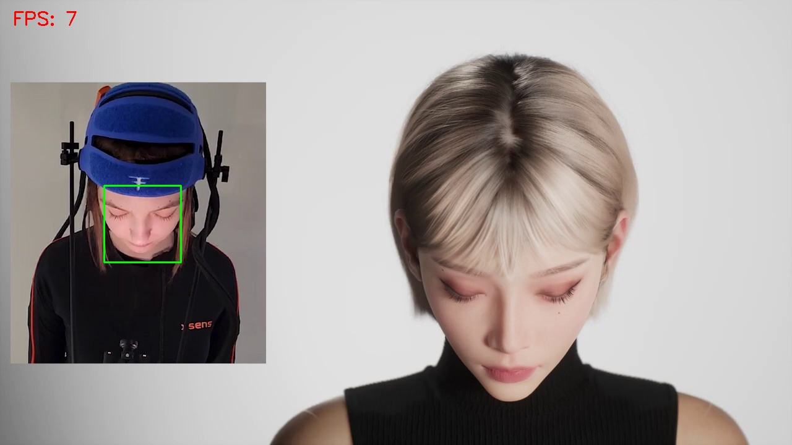
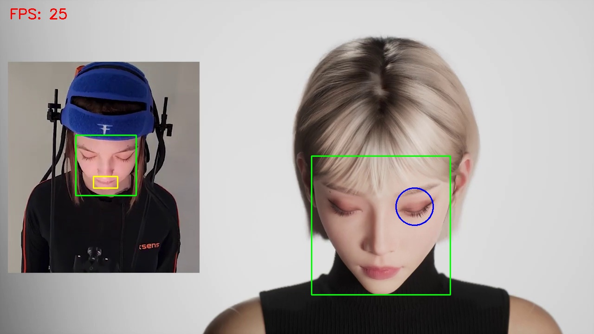
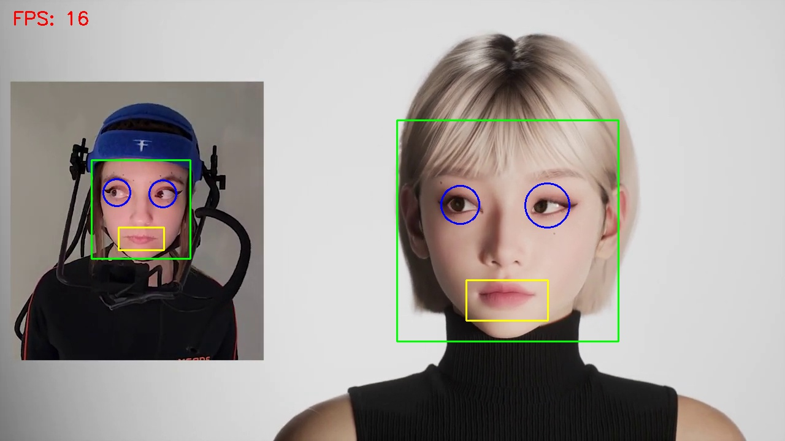

# Обнаружение лица, глаз и улыбки на видео с помощью OpenCV

Программа выполняет обработку видеопотока и автоматически обнаруживает лица, глаза и улыбки на кадрах видео. Для этого используются каскадные классификаторы Хаара (Haar Cascade Classifiers), входящие в библиотеку OpenCV. Найденные объекты выделяются графическими элементами: лицо прямоугольником, глаза окружностями, улыбка прямоугольником.

## Реализовано

- Загрузка видеопотока из файла `ZUA.mp4`.
- Использование каскадных классификаторов:
  - `haarcascade_frontalface_default.xml` для обнаружение лиц;
  - `haarcascade_eye.xml` для обнаружение глаз;
  - `haarcascade_smile.xml` для обнаружение улыбки.
- Предварительная обработка кадров:
  - преобразование изображения в оттенки серого;
  - выравнивание гистограммы (`equalizeHist`) для улучшения контраста.
- Обнаружение лиц на кадре (`detectMultiScale`).
- Обнаружение глаз внутри области лица:
  - фильтрация объектов, расположенных только в верхней половине лица;
  - ограничение количества найденных глаз (не более двух);
  - сортировка по размеру для выбора наиболее вероятных объектов.
- Обнаружение улыбки внутри области лица:
  - поиск только в нижней половине лица;
  - выбор наиболее крупного объекта, соответствующего улыбке.
- Визуализация результатов:
  - зелёный прямоугольник для лица;
  - синие окружности для глаз;
  - жёлтый прямоугольник для улыбки.
- Расчёт производительности:
  - вычисление FPS (количество кадров в секунду);
  - отображение FPS в левом верхнем углу кадра.
- Отображение обработанного видео в реальном времени.

## Запуск программы

1. Убедитесь, что в папке с исполняемым файлом (или в системном PATH) присутствуют следующие DLL-файлы OpenCV:
   - `opencv_world480.dll`
   - `opencv_world480d.dll` (для отладочной сборки)
   - `opencv_videoio_ffmpeg480_64.dll`
2. Запустите `main.exe`.
3. На экране откроются окно `Face / Eyes / Smile detection` (видео с обнаруженными лицами, глазами и улыбками).
4. В папке с программой будут сохранены файлы `result1.png`, `result10.png` и `result100.png`.
5. Для завершения работы программы нажмите клавишу Esc, когда фокус находится на одном из окон OpenCV.

## Используемые функции OpenCV

| Функция | Назначение |
|--------|------------|
| `CascadeClassifier` | Загрузка и использование каскадных классификаторов |
| `VideoCapture()` | Открытие видеофайла |
| `cvtColor()` | Преобразование BGR -> Grayscale |
| `equalizeHist()` | Улучшение контраста изображения |
| `detectMultiScale()` | Обнаружение объектов на изображении |
| `rectangle()` | Отрисовка прямоугольника вокруг объекта |
| `circle()` | Отрисовка окружности (для глаз) |
| `putText()` | Вывод текста (FPS) на изображение |
| `imshow()` | Отображение кадра |
| `waitKey()` | Ожидание нажатия клавиши |
| `getTickCount()` | Получение времени для расчёта FPS |
| `getTickFrequency()` | Частота таймера OpenCV |
| `destroyAllWindows()` | Закрытие всех окон OpenCV |

## Результат работы

| Результат |
|-----------|
|  |
|  |
|  |